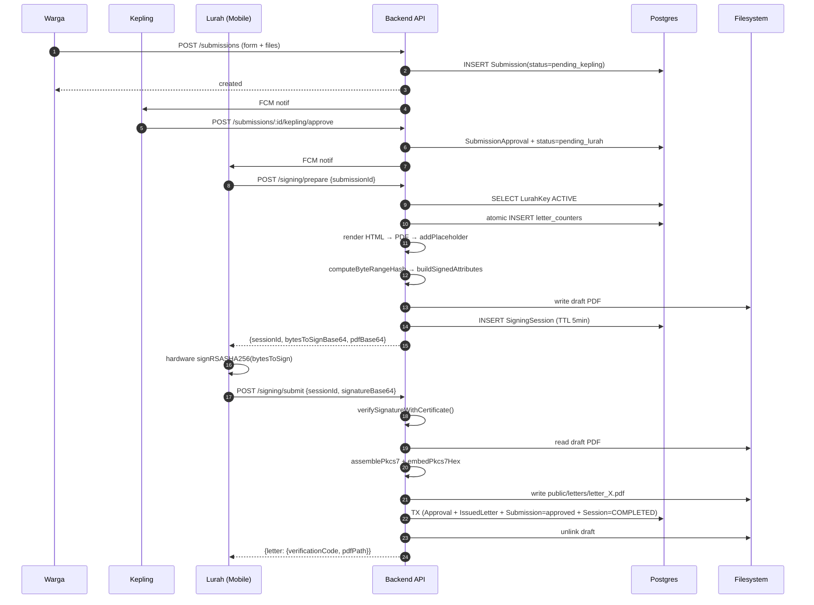

# System Design — Penerbitan & Penandatanganan Surat Elektronik

Dokumen ini menjelaskan arsitektur, mekanisme, dan alur end-to-end dari fitur penerbitan surat elektronik di sistem **E-Kelurahan Talete Satu**, termasuk seluruh proses kriptografis (enrollment sertifikat, PAdES signing, hybrid verification).

> Audien: kontributor backend, evaluator skripsi, auditor keamanan.
> File terkait: [src/services/](src/services/) (seluruh service yang dibahas), [prisma/schema.prisma](prisma/schema.prisma) (model database), [src/templates/](src/templates/) (template surat).

---

## 1. Overview

Sistem menerbitkan **surat elektronik bertandatangan digital** dengan properti:

1. **Otentik** — ditandatangani oleh Lurah aktif yang sertifikatnya diterbitkan Root CA milik kelurahan.
2. **Tidak dapat dimodifikasi tanpa terdeteksi** — menggunakan PAdES (PDF Advanced Electronic Signature) berbasis PKCS#7/CMS detached signature.
3. **Dapat diverifikasi publik** — siapa pun dapat memverifikasi surat tanpa login, melalui dua jalur yang saling melengkapi (hybrid verification): pencarian server-side berdasarkan kode verifikasi dan verifikasi kriptografis PAdES.
4. **Private key tidak menyentuh server** — sejak revisi keystore, private key Lurah hanya tinggal di perangkat mobile-nya. Server hanya menerima CSR, menerbitkan sertifikat, dan menerima signature jadi.

### Stack relevan

| Komponen | Library |
|---|---|
| PDF rendering | Puppeteer (headless Chromium) |
| PDF signature placeholder | `@signpdf/placeholder-plain` + `@signpdf/utils` |
| QR code generation | `qrcode` |
| QR code decoding | `pdf-to-img` + `sharp` + `jsqr` |
| Kriptografi (RSA, X.509, ASN.1) | `node-forge` + Node.js `crypto` |
| Database ORM | Prisma 7 + PostgreSQL |

---

## 2. Aktor & Peran

| Aktor | Peran dalam Penerbitan Surat |
|---|---|
| **Warga** | Membuat pengajuan surat dengan dokumen pendukung |
| **Kepling** (Kepala Lingkungan) | Approval pertama: verifikasi data dasar warga |
| **Lurah** | Approval final + menandatangani PDF dengan private key di mobile-nya |
| **Admin** | Bootstrap Root CA, monitoring, revoke surat/key |
| **Mobile App** (perangkat Lurah) | Menyimpan private key, melakukan signing offline, mengirim signature ke server |
| **Verifikator publik** | Siapa pun yang ingin memverifikasi keaslian surat melalui QR code atau kode manual |

---

## 3. State Machine Submission

```
[warga buat]      [kepling approve]      [lurah sign]
   ─────►  pending_kepling  ─────►  pending_lurah  ─────►  approved
                 │                          │
                 │ reject                   │ reject
                 ▼                          ▼
              rejected                  rejected
```

Status `issued` digunakan ketika `IssuedLetter` record sudah terbuat. Pada implementasi sekarang transisi `pending_lurah → approved` terjadi atomik bersama pembuatan `IssuedLetter` di [signing.service.js:207-244](src/services/signing.service.js#L207-L244).

---

## 4. Komponen Layanan

### 4.1 [template.service.js](src/services/template.service.js)

Bertanggung jawab atas **konten surat**. Tiap jenis surat punya direktori sendiri di [src/templates/](src/templates/) berisi:

- `schema.json` — definisi field yang wajib diisi warga, file lampiran yang dibutuhkan, `letterPrefix`, dan `validityDays`
- `template.html` — template HTML dengan placeholder `{{NAMA_LENGKAP}}`, `{{NOMOR_SURAT}}`, `{{QR_CODE_DATA}}`, dll.

Method utama:

- `getSchema(type)` — load skema dengan cache di-memory ([template.service.js:39-67](src/services/template.service.js#L39-L67))
- `validatePayload(type, payload)` — validasi field warga sesuai skema
- `prepareTemplateData(submission, options)` — gabung data kependudukan + payload warga + metadata surat (nomor, lurah, URL) jadi satu objek
- `renderTemplate(type, data)` — replace semua `{{KEY}}` dengan value (case-insensitive via uppercase keys di [template.service.js:154-157](src/services/template.service.js#L154-L157))

### 4.2 [letter.service.js](src/services/letter.service.js)

Bertanggung jawab atas **identitas surat**: nomor dan kode verifikasi.

- `generateLetterIdentity(type)` — mengelola dua counter atomik di tabel `letter_counters`:
  - **Global counter** (`letter_type = 'GLOBAL'`) menentukan urutan sequence yang muncul di nomor surat
  - **Per-type counter** dipertahankan untuk reporting tahunan
  
  Format kode verifikasi: `{8-char-hex}-{sequence-3-digit}` (contoh: `D5F38B2B-001`).
  Format nomor surat: `{verificationCode}/{kelurahanCode}/{letterPrefix}/{roman-month}/{year}` (contoh: `D5F38B2B-001/2009/SKD/V/2026`).
  
  Implementasi atomik menggunakan `INSERT ... ON CONFLICT DO UPDATE` di dalam `prisma.$transaction` ([letter.service.js:55-77](src/services/letter.service.js#L55-L77)).

- `getLetterByVerificationCode`, `getLetterBySubmissionId`, `getLettersByUser`, `getAllLetters` — query untuk warga, admin, dan publik. `getAllLetters` mengurutkan berdasarkan sequence number yang di-extract dari `letter_number` via SQL substring.

- `revokeLetter({ verificationCode, reason })` — set `isRevoked = true` + audit timestamp.

### 4.3 [pdf.service.js](src/services/pdf.service.js)

Bertanggung jawab atas **manipulasi PDF**. Modul ini secara eksplisit **TIDAK** mengakses private key atau membentuk struktur PKCS#7 (lihat komentar header [pdf.service.js:18-32](src/services/pdf.service.js#L18-L32)).

Tanggung jawab:

| Method | Fungsi |
|---|---|
| `renderHtmlToPdf({ html, verificationUrl })` | Render HTML→PDF lewat Puppeteer setelah inject QR + logo sebagai data URL |
| `generateQRCode(data, opts)` | Encode payload (verification URL) jadi PNG data URL |
| `addByteRangePlaceholder(pdfBuffer)` | Sisipkan signature dictionary kosong di PDF: `/ByteRange [0 X Y Z]` + `/Contents <00..00>` placeholder sepanjang `PADES_PLACEHOLDER_BYTES = 8192` bytes ([pdf.service.js:171-202](src/services/pdf.service.js#L171-L202)) |
| `extractByteRange(pdfBuffer)` | Parse posisi `/ByteRange` dan `/Contents` dari PDF yang sudah punya placeholder |
| `computeByteRangeHash(pdfBuffer, byteRange)` | Hitung SHA-256 dari dua segmen bytes yang ditunjuk ByteRange (yaitu seluruh PDF kecuali area `/Contents`) |
| `embedPkcs7Hex(pdfBuffer, hex, offset, len)` | Tulis hex PKCS#7 ke dalam slot `/Contents`, padding zero kalau lebih pendek |
| `extractQRCodeFromPdf(pdfBuffer)` | (Untuk verifikasi) Rasterize page lewat pdf-to-img, decode QR dengan jsqr |

**Kenapa dipisah signing dan PDF manipulation?** Karena private key tidak ada di server. PDF service hanya menyiapkan "bytes yang harus ditandatangani" (signed attributes) dan slot kosong untuk menampung hasil signature dari mobile.

### 4.4 [pkcs7.service.js](src/services/pkcs7.service.js)

Bertanggung jawab atas struktur **PKCS#7 / CMS SignedData**. Modul ini juga **tidak mengakses private key**; ia hanya membangun dan mem-parse ASN.1.

Tanggung jawab utama:

1. **`buildSignedAttributesDer(documentHash, signerCertObj, signingTime)`** — bangun DER-encoded SET dari empat signed attributes ([pkcs7.service.js:83-98](src/services/pkcs7.service.js#L83-L98)):
   - `contentType` = `data`
   - `messageDigest` = SHA-256 dari ByteRange PDF
   - `signingTime` = waktu prepare-signing
   - `signingCertificateV2` = ESSCertIDv2 (hash SHA-256 dari DER sertifikat signer) — wajib untuk PAdES Baseline B-B
   
   Output DER inilah yang **dikirim ke mobile untuk ditandatangani** (BUKAN PDF mentah).

2. **`assemblePkcs7SignedData(signedAttrsDer, signatureBuffer, signerCertObjOrPem)`** — bangun struktur lengkap CMS ContentInfo + SignedData berisi sertifikat signer dan satu SignerInfo ([pkcs7.service.js:100-135](src/services/pkcs7.service.js#L100-L135)). Output buffer ini yang di-embed di `/Contents`.

3. **`parsePkcs7FromHex(hexString)`** — parse PKCS#7 dari hex di `/Contents`, return:
   - `signedAttributesDer` (re-canonicalized untuk verify)
   - `signatureBytes`
   - `signerCertPem`
   - `messageDigest` (untuk dibandingkan dengan ByteRange hash)
   - `signingTime`, `signerCommonName`
   
   **Penting**: parse adalah operasi ASN.1 decoding murni — tidak peduli signature valid atau tidak. Karena itu kode verifikasi bisa dibaca walaupun PDF di-tamper.

### 4.5 [signing.service.js](src/services/signing.service.js)

**Orchestrator** end-to-end untuk signing flow. Inilah otak fitur penerbitan surat.

Dua endpoint utama yang dilayaninya:

#### A. `prepareSigning({ submissionId, lurahUserId })`

Dipanggil ketika Lurah memutuskan untuk menyetujui pengajuan dan mulai menandatangani. Langkah-langkah ([signing.service.js:89-145](src/services/signing.service.js#L89-L145)):

1. **Guard** — validasi submission ada, status `pending_lurah`, belum ada `IssuedLetter`, data kependudukan lengkap, sertifikat Lurah aktif & belum expired.
2. **Generate identitas** — panggil `letterService.generateLetterIdentity(submission.type)` untuk dapat `verificationCode` + `letterNumber`.
3. **Compose URL & template** — bangun `verificationUrl` dari `env.VERIFICATION_URL` + `?code={verificationCode}`, render template HTML lewat template service.
4. **Render PDF + sisipkan placeholder** — `pdfService.renderHtmlToPdf` → `pdfService.addByteRangePlaceholder` menghasilkan PDF dengan slot signature kosong.
5. **Hitung hash & bangun signed attributes** — `extractByteRange` → `computeByteRangeHash` → `pkcs7Service.buildSignedAttributesDer(hash, cert, issuedDate)`.
6. **Persist draft + session** — simpan PDF draft di `storage/letter-drafts/draft_{submissionId}_{ts}.pdf` (di luar `public/`), simpan record `SigningSession` dengan TTL 5 menit berisi `bytesToSignBase64`, `pdfDraftPath`, `verificationCode`, `letterNumber`.
7. **Return ke mobile**:
   ```json
   {
     "sessionId": "...",
     "expiresAt": "...",
     "pdfBase64": "<PDF dengan placeholder, untuk preview>",
     "bytesToSignBase64": "<DER signed-attributes — INI yang ditandatangani>",
     "preview": { "letterNumber": "...", "verificationCode": "...", ... }
   }
   ```

Mobile menggunakan private key offline (Android KeyStore / iOS Keychain) untuk RSA-SHA256 sign `bytesToSignBase64`, kemudian kirim signature kembali.

#### B. `submitSignature({ submissionId, lurahUserId, sessionId, signatureBase64, note, keterangan })`

Dipanggil mobile setelah signing selesai. Langkah ([signing.service.js:147-260](src/services/signing.service.js#L147-L260)):

1. **Guard session** — session ada, milik submission + user yang sama, status `PENDING`, belum expired, sertifikat masih `ACTIVE`.
2. **Verifikasi signature** — `cryptoService.verifySignatureWithCertificate(bytesToSign, signature, certificatePem)`. Kalau gagal → throw `SIGNATURE_INVALID`. Ini guard penting: memastikan mobile yang melakukan signing memang punya private key yang sesuai dengan sertifikat yang sudah enrolled.
3. **Baca draft PDF** dari `pdfDraftPath`.
4. **Assemble PKCS#7** — `pkcs7Service.assemblePkcs7SignedData(bytesToSign, signatureBytes, certObj)` → DER buffer.
5. **Embed PKCS#7 ke draft** — `pdfService.embedPkcs7Hex(draftPdf, pkcs7.toString('hex'), contentsHexOffset, contentsHexLength)` → final signed PDF.
6. **Persist** — `pdfService.savePdf` ke `public/letters/letter_{verificationCode}.pdf`.
7. **Transaction**:
   - `SubmissionApproval` baru dengan stage `lurah`, status `approved`
   - `IssuedLetter` baru dengan letter number, verification code, `signedBy = lurahProfileId`, `signatureKeyId = keyId`, `pdfPath`, `signedAt`, `expiresAt` (berdasarkan `validityDays` di schema)
   - Submission status → `approved`
   - Session status → `COMPLETED`
8. **Cleanup** — hapus draft PDF.
9. **Return** — submission + letter object.

#### C. `cleanupExpiredSessions()` — best-effort cron yang menandai session PENDING expired & menghapus draft yang tertinggal.

### 4.6 [crypto.service.js](src/services/crypto.service.js)

Setelah revisi keystore, modul ini **hanya untuk verifikasi**. Tidak ada operasi yang membutuhkan private key Lurah.

| Method | Fungsi |
|---|---|
| `verifySignatureWithCertificate(bytes, sig, certPem)` | RSA-SHA256 verify menggunakan public key dari sertifikat |
| `verifyCertChain(leafPem, rootPem)` | Verifikasi rantai sertifikat ke Root CA + cek validity period |
| `computeCertFingerprint(certPem)` | SHA-256 dari DER sertifikat (digunakan untuk match dengan `lurahKey.fingerprint` di DB) |
| `revokeKey(keyId, adminId, reason)` | Set status key ke `REVOKED` (admin action) |
| `deactivateKeysForUser(profileId, adminId)` | Mass-deactivate semua key milik satu Lurah profile |
| `getActivePublicKey`, `getAllPublicKeys`, `getLurahKeyByUserId` | Query helper |

### 4.7 [ca.service.js](src/services/ca.service.js)

Mengelola **Root CA milik kelurahan**. Root CA adalah self-signed RSA-4096 dengan validity 10 tahun, subject `CN=Kelurahan Talete Satu Root CA`.

| Method | Fungsi |
|---|---|
| `bootstrapRootCa()` | Generate keypair + self-sign cert + simpan terenkripsi (AES-256) ke `secure-storage/`. Dijalankan sekali via `scripts/bootstrap-root-ca.js` |
| `loadRootCa()` | Lazy-load dengan in-memory cache; dekripsi private key dengan `ROOT_CA_KEY_PASSPHRASE` |
| `signCsr(csrPem)` | Validasi CSR (subject harus match template Lurah), terbitkan sertifikat 3 tahun, return `{ certificatePem, publicKeyPem, serialNumber, fingerprint, issuedAt, expiresAt }` |
| `getRootCaPem()` | Untuk verifier publik agar bisa verify chain |

**Security note**: private key Root CA tersimpan di filesystem terenkripsi (passphrase via env var). Untuk production deployment yang lebih ketat, key ini sebaiknya diserahkan ke HSM atau KMS.

### 4.8 [enrollment.service.js](src/services/enrollment.service.js)

Mengelola **siklus hidup sertifikat Lurah**: enrollment awal, rotation, dan validasi token enrollment.

Token enrollment adalah random 32-byte (TTL 10 menit) yang harus dimiliki mobile sebelum boleh submit CSR. Disimpan di in-memory `Map` dengan auto-cleanup ([enrollment.service.js:12-21](src/services/enrollment.service.js#L12-L21)).

Tiga purpose berbeda untuk token:

| Purpose | Endpoint | Guard |
|---|---|---|
| `ENROLLMENT` | `submitCsr()` | Lurah belum punya active cert |
| `ROTATION` | `rotateCsr()` | Lurah punya active cert (cert lama di-revoke saat rotation sukses) |

Flow `submitCsr`:

1. Validate token & purpose
2. `caService.signCsr(csrPem)` — issue sertifikat baru
3. Transaction:
   - Deactivate semua key ACTIVE lama Lurah ini (jaga-jaga, biasanya sudah tidak ada)
   - Insert `LurahKey` baru: `publicKey`, `certificatePem`, `serialNumber`, `fingerprint`, `expiresAt`
4. Mark token used
5. Return `{ keyId, certificatePem, rootCaCertificatePem, ... }` ke mobile

**Important**: server **tidak pernah** melihat private key. Mobile generate CSR locally menggunakan key yang disimpan di hardware-backed keystore.

### 4.9 [submission.service.js](src/services/submission.service.js)

Mengelola **business logic submission** dan notifikasi. Method yang relevan untuk alur signing:

- `createSubmission` — warga buat pengajuan + auto-notify kepling aktif
- `approveByKepling`, `rejectByKepling` — kepling action + notify lurah & warga
- `rejectByLurah` — lurah tolak (approve flow ditangani `signing.service.js`)

Setiap mutasi yang mengubah status akan kirim FCM push notification via `sendToUser()` ([submission.service.js:76-84](src/services/submission.service.js#L76-L84)). Implementasi push diatur di `notification.service.js`.

---

## 5. Alur End-to-End Penerbitan Surat

### Phase 1: Pengajuan oleh Warga

```
Warga ──POST /v1/submissions──► submission.controller
                                    │
                              submission.service
                              .createSubmission()
                                    │
                                    ▼
                             DB: Submission (status: pending_kepling)
                                  + SubmissionDocument[]
                                    │
                                    ▼
                             FCM ──► Kepling aktif (push notif)
```

Validator: dokumen wajib (Multer 5MB cap, MIME whitelist JPEG/PNG/PDF), payload sesuai `schema.json`.

### Phase 2: Persetujuan Kepling

```
Kepling ──POST /v1/submissions/:id/kepling/approve──► submission.service
                                                          .approveByKepling()
                                                              │
                                                  Transaction:
                                                    - SubmissionApproval (stage=kepling, status=approved)
                                                    - Submission.status = pending_lurah
                                                              │
                                                              ▼
                                                  FCM ──► Lurah aktif + Warga
```

### Phase 3: Prepare Signing (Lurah memutuskan menandatangani)

```
Lurah Mobile ──POST /v1/signing/prepare {submissionId}──► signing.service.prepareSigning()
   │
   │       ┌─────────────────────────────────────────────────────────┐
   │       │ 1. Guard: pending_lurah, belum ada IssuedLetter           │
   │       │ 2. Get active LurahKey (cert masih valid)                 │
   │       │ 3. letter.service.generateLetterIdentity()                │
   │       │    └─ atomic INSERT counters → {code, number}             │
   │       │ 4. template.service.renderTemplate()                       │
   │       │ 5. pdf.service.renderHtmlToPdf({html, verificationUrl})   │
   │       │ 6. pdf.service.addByteRangePlaceholder(pdfBuf)             │
   │       │    └─ inject /ByteRange + /Contents<00..00>                │
   │       │ 7. pdf.service.extractByteRange + computeByteRangeHash    │
   │       │ 8. pkcs7.service.buildSignedAttributesDer(hash, cert, ts) │
   │       │ 9. Save draft + create SigningSession (TTL 5min)          │
   │       └─────────────────────────────────────────────────────────┘
   │
   │◄── { sessionId, bytesToSignBase64, pdfBase64, preview }
```

### Phase 4: Mobile Signing (offline, di perangkat Lurah)

```
Mobile App:
  bytesToSign = base64Decode(bytesToSignBase64)
  signature   = AndroidKeyStore.signRSASHA256(bytesToSign)  // private key tidak pernah leaks
  signatureBase64 = base64Encode(signature)
```

Mobile boleh menampilkan preview PDF (`pdfBase64`) ke Lurah agar bisa visually inspect sebelum confirm.

### Phase 5: Submit Signature

```
Lurah Mobile ──POST /v1/signing/submit──► signing.service.submitSignature()
              { sessionId, signatureBase64, note?, keterangan? }
   │
   │       ┌─────────────────────────────────────────────────────────┐
   │       │  1. Guard: session valid, not expired/completed           │
   │       │  2. crypto.service.verifySignatureWithCertificate()       │
   │       │     └─ jika gagal: throw SIGNATURE_INVALID                │
   │       │  3. Read draft PDF dari pdfDraftPath                       │
   │       │  4. pkcs7.service.assemblePkcs7SignedData()                │
   │       │     └─ ContentInfo[SignedData[cert, signerInfo[sig]]]      │
   │       │  5. pdf.service.embedPkcs7Hex()                            │
   │       │     └─ tulis hex ke slot /Contents (pad 0)                 │
   │       │  6. pdf.service.savePdf() → public/letters/letter_X.pdf    │
   │       │  7. Transaction:                                            │
   │       │     - SubmissionApproval(stage=lurah, status=approved)     │
   │       │     - IssuedLetter (verificationCode, letterNumber,        │
   │       │       signedBy, signatureKeyId, pdfPath, signedAt,         │
   │       │       expiresAt = issued + validityDays)                   │
   │       │     - Submission.status = approved                          │
   │       │     - SigningSession.status = COMPLETED                     │
   │       │  8. Unlink draft PDF                                        │
   │       └─────────────────────────────────────────────────────────┘
   │
   │◄── { submission, letter: { verificationCode, pdfPath, ... } }
```

PDF final tersedia di URL publik: `${BASE_URL}/public/letters/letter_{verificationCode}.pdf`.

---

## 6. Alur Enrollment Sertifikat

### 6.1 Bootstrap Root CA (sekali, oleh admin saat setup server)

```
Admin:
  $ ROOT_CA_KEY_PASSPHRASE=<strong-passphrase> node scripts/bootstrap-root-ca.js
       │
       ▼
  ca.service.bootstrapRootCa()
       │
       ├─ Generate RSA-4096 keypair (forge)
       ├─ Self-sign cert (subject = issuer = Kelurahan Talete Satu Root CA, validity 10y)
       ├─ Write secure-storage/root-ca-cert.pem (mode 0644)
       └─ Write secure-storage/root-ca-key.pem (AES-256 encrypted, mode 0600)
```

### 6.2 Enrollment Awal Lurah (Lurah baru atau setelah revoke total)

```
Lurah Mobile ──POST /v1/enrollment/token──► enrollment.service.issueEnrollmentToken()
    │                                          (purpose: ENROLLMENT)
    │◄── { enrollmentToken, expiresAt, subjectTemplate }
    │
    │  // Mobile: generate keypair di hardware keystore
    │  // Build CSR dengan subject dari subjectTemplate
    │
    └──POST /v1/enrollment/submit──► enrollment.service.submitCsr()
       { enrollmentToken, csrPem, deviceLabel }
                                     │
                              ┌──────┴──────┐
                              │ Validate token (purpose=ENROLLMENT, not used, not expired)
                              │ ca.service.signCsr(csrPem)
                              │   ├─ verify CSR signature
                              │   ├─ validate subject match template
                              │   └─ issue cert (validity 3y)
                              │ Transaction:
                              │   - deactivate ACTIVE keys lama
                              │   - insert LurahKey baru
                              │ Mark token used
                              └──────┬──────┘
                                     ▼
       ◄── { keyId, certificatePem, rootCaCertificatePem, serial, fingerprint, expiresAt }
```

### 6.3 Rotation Sertifikat (sebelum cert expired atau atas inisiatif Lurah)

Sama dengan flow di atas, tapi purpose `ROTATION` dan guard memastikan **harus ada** active key sebelumnya. Saat sukses, cert lama di-revoke dengan reason `ROUTINE_ROTATION` dan cert baru dibuat ACTIVE.

### 6.4 Revoke Key (admin action)

`crypto.service.revokeKey(keyId, adminId, reason)` mengubah status key dari `ACTIVE` ke `REVOKED`. Setelah revoke:

- Endpoint `prepareSigning` akan menolak Lurah dengan kode `ENROLLMENT_REQUIRED`
- Verifikasi surat yang sudah pernah ditandatangani **tetap valid sebagai snapshot** kalau `signedAt ≤ deactivatedAt` ([verification.service.js:141-150](src/services/verification.service.js#L141-L150)) — ini agar surat lama tidak otomatis batal karena rotasi key.

---

## 7. Arsitektur Kriptografi

### 7.1 PKI Hierarchy

```
                    ┌─────────────────────────┐
                    │   Root CA (self-signed)  │
                    │   RSA-4096, validity 10y │
                    │   stored encrypted (AES-256)
                    │   secure-storage/        │
                    └────────────┬─────────────┘
                                 │ signs
                                 ▼
                    ┌─────────────────────────┐
                    │   Lurah Certificate      │
                    │   RSA from mobile CSR    │
                    │   validity 3y            │
                    │   stored in LurahKey     │
                    └─────────────────────────┘
                                 │ private key
                                 ▼
                    ┌─────────────────────────┐
                    │   Mobile Device          │
                    │   (Android KeyStore /    │
                    │    iOS Secure Enclave)   │
                    └─────────────────────────┘
```

### 7.2 PAdES Baseline B-B Detail

Surat ditandatangani dengan format **PAdES Baseline B-B** menggunakan PKCS#7/CMS detached signature. Struktur signature dictionary yang ditulis di PDF:

```
<<
  /Type /Sig
  /Filter /Adobe.PPKLite
  /SubFilter /ETSI.CAdES.detached       ← penanda PAdES
  /ByteRange [0 X Y Z]                   ← dua segmen bytes yang di-hash
  /Contents <00...PKCS7 HEX...00>        ← signature blob, padded
  /Reason (Persetujuan Surat ...)
  /ContactInfo (Kelurahan ...)
  /Name (Lurah Talete Satu)
  /Location (Tomohon, Sulawesi Utara)
  /M (D:YYYYMMDDHHMMSS+OO'00')
>>
```

`/ByteRange` menunjuk dua range bytes: dari awal PDF sampai sebelum `<` di `/Contents`, dan dari setelah `>` sampai akhir PDF. Hash SHA-256 dari kedua range inilah yang masuk ke `messageDigest` di signed attributes.

### 7.3 Apa yang Sebenarnya Ditandatangani Mobile

Mobile **TIDAK** menandatangani PDF mentah. Yang ditandatangani adalah DER-encoded **signed attributes** dari PKCS#7:

```
SET (signed attributes) {
  Attribute { OID=contentType,           value=data }
  Attribute { OID=messageDigest,         value=SHA256(ByteRange) }     ← linking ke PDF
  Attribute { OID=signingTime,           value=UTCTime }
  Attribute { OID=signingCertificateV2,  value=SHA256(signerCert) }    ← linking ke cert
}
```

Karena `messageDigest` adalah hash dari bytes PDF (kecuali area `/Contents`), perubahan **sebyte pun** pada PDF di luar `/Contents` akan membuat hash tidak cocok → signature invalid → verifier melaporkan TAMPERED.

Karena `signingCertificateV2` adalah hash dari sertifikat signer, attacker tidak bisa menukar sertifikat dengan sertifikat lain tanpa break signature.

### 7.4 Storage Sensitif

| Asset | Lokasi | Proteksi |
|---|---|---|
| Root CA private key | `secure-storage/root-ca-key.pem` | AES-256 encrypted, passphrase di env var |
| Lurah private key | Mobile hardware keystore | OS-level, tidak pernah ke server |
| Lurah public key + cert | `lurah_keys` table (Postgres) | Bukan rahasia |
| Signing session draft | `storage/letter-drafts/*.pdf` | Di luar `public/`, dihapus setelah signing atau session expired |
| Final signed PDF | `public/letters/letter_*.pdf` | Publik (memang harus bisa diakses verifier) |

---

## 8. Database Models Utama

Referensi: [prisma/schema.prisma](prisma/schema.prisma).

| Model | Tujuan |
|---|---|
| `Submission` | Pengajuan warga (status state machine) |
| `SubmissionApproval` | Audit trail tiap approval/rejection (kepling, lurah) |
| `SubmissionDocument` | Lampiran yang di-upload warga |
| `LurahProfile` | Profile Lurah aktif (nama, NIP, jabatan) |
| `LurahKey` | Sertifikat + public key Lurah dengan status (ACTIVE/INACTIVE/REVOKED/EXPIRED) |
| `IssuedLetter` | Surat yang sudah diterbitkan, link ke `signatureKeyId` agar verifier tahu key mana yang dipakai |
| `SigningSession` | Session temporary (TTL 5 menit) untuk mobile signing |
| `LetterCounter` | Counter atomik untuk nomor surat (composite key `letter_type` + `year`) |
| `VerificationLog` | Audit log tiap attempt verifikasi (untuk forensic) |

---

## 9. Hybrid Verification (Sisi Pembaca)

Walaupun fokus dokumen ini adalah penerbitan, perlu disebut singkat bagaimana surat di-verify karena bentuk surat ditentukan oleh kebutuhan verifikasi.

Verifier punya dua jalur independen ([verification.service.js](src/services/verification.service.js)):

1. **Server lookup branch** — extract kode verifikasi dari QR code di PDF → query `IssuedLetter` di DB. Hasil: `pass` / `not_found` / `revoked` / `expired`.
2. **PAdES crypto branch** — parse PKCS#7 dari `/Contents`, verify signature, cek cert chain ke Root CA, cek fingerprint cert match dengan `lurahKey.fingerprint` di DB. Hasil: `pass` / `content_modified` / `signature_invalid` / `untrusted` / dst.

Kombinasi keduanya menghasilkan status final:

| Server | PAdES | Status |
|---|---|---|
| pass | pass | `VALID` |
| revoked | pass | `REVOKED` |
| expired | pass | `EXPIRED` |
| not_found | pass | `UNREGISTERED_BUT_VALID_SIGNATURE` |
| pass | content_modified / signature_invalid | `TAMPERED` |
| pass | missing_pades | `TAMPERED_QR_TRANSPLANT` (QR disalin dari surat lain ke PDF tanpa signature) |
| pass | untrusted | `UNTRUSTED_SIGNER` |
| pass | revoked_key | `REVOKED_SIGNER` |
| not_found | missing/invalid | `FAKE` |

Dua jalur ini saling melengkapi: server lookup memberikan **informasi forensik** ("kode ini pernah valid"), crypto branch memberikan **jaminan otentisitas** ("dokumen ini tidak dimodifikasi"). Status `TAMPERED_QR_TRANSPLANT` adalah contoh nilai hybrid: tanpa server lookup, kasus ini hanya akan jadi "invalid"; dengan hybrid, verifier dapat pesan eksplisit bahwa QR-nya valid tapi dokumennya bukan dokumen asli.

---

## 10. Daftar Skenario Testing yang Disarankan

Untuk validasi end-to-end:

| Skenario | Input | Expected Status |
|---|---|---|
| Surat asli, tidak dimodifikasi | PDF dari `public/letters/` | `VALID` |
| Konten PDF dimodifikasi (text), QR & signature utuh | PDF yang byte-nya di-flip | `TAMPERED` |
| Signature di-strip, QR tetap ada (QR transplant) | PDF tanpa `/ByteRange` | `TAMPERED_QR_TRANSPLANT` |
| Surat asli yang sudah di-revoke | revoke via admin, lalu verify | `REVOKED` |
| Surat sudah lewat `expiresAt` | tunggu / set issuedAt mundur | `EXPIRED` |
| Sertifikat Lurah di-revoke setelah surat diterbitkan | revoke key, surat lama | `VALID` (karena `signedAt ≤ deactivatedAt`) |
| Sertifikat Lurah di-revoke sebelum surat | edge case yang tidak boleh terjadi | `REVOKED_SIGNER` |
| PDF bukan surat sistem, tanpa QR | PDF random | `FAKE` |
| Mobile signing dengan key salah | signature dari key lain | `SIGNATURE_INVALID` (di submit-signature) |

---

## 11. Catatan Keamanan & Limitasi

1. **Root CA passphrase di env var** — untuk production sebaiknya pakai secret manager (Vault, AWS Secrets Manager) atau HSM untuk key Root CA.
2. **Mobile attestation belum di-enforce** — server tidak memverifikasi bahwa CSR berasal dari hardware-backed keystore. Kalau ini matter, mobile harus kirim Android Key Attestation chain dan server harus verify-nya.
3. **Session in-memory (enrollment token)** — kalau backend di-scale horizontal, perlu pindah ke Redis. Saat ini implementasi hanya cocok untuk single-instance.
4. **Tidak ada timestamping authority (TSA)** — `signingTime` di signed attributes diisi server dan tidak dibuktikan oleh otoritas eksternal. Untuk legal non-repudiation lebih kuat, integrasikan dengan TSA RFC3161.
5. **QR decode performance** — rasterize page A4 di scale 2 makan ~400-500ms per request. Untuk traffic tinggi, cache hasil decode by SHA-256 file hash.
6. **PDF placeholder size** — `PADES_PLACEHOLDER_BYTES = 8192` adalah upper bound untuk PKCS#7 hex. Jika cert chain memanjang atau ditambah TSA token, harus dinaikkan.

---

## 12. Ringkasan Sequence (Mermaid)



---

*Last updated: 2026-05-27. File ini didokumentasikan dari implementasi pada branch `keystore-revision`.*
