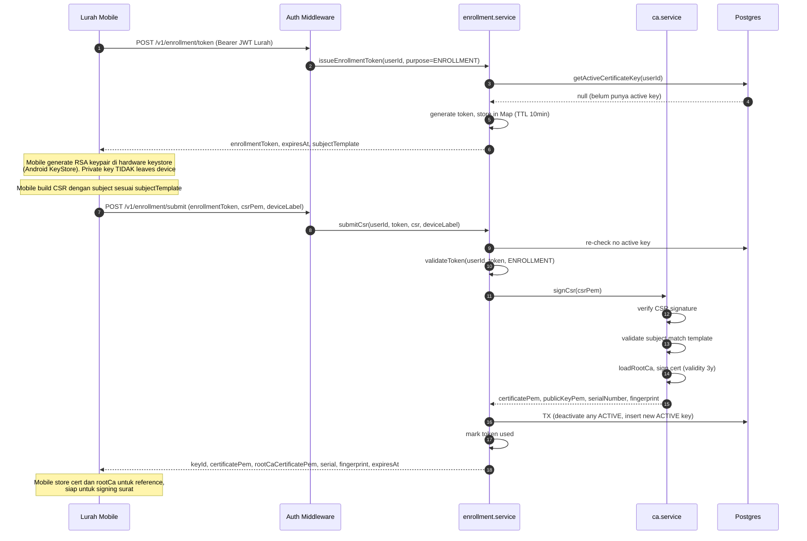
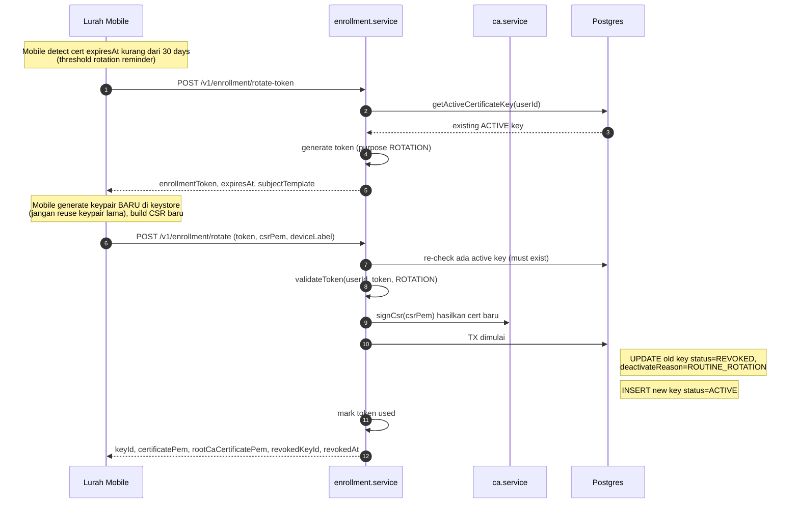

# System Design — Pengelolaan Key & Sertifikat Lurah

Dokumen ini menjelaskan arsitektur, proses, dan mekanisme dari pengelolaan kunci kriptografis (key) milik Lurah pada sistem **E-Kelurahan Talete Satu** — mulai dari bootstrap Root CA, enrollment awal, rotation, sampai revocation. Dokumen ini melengkapi [LETTER_ISSUANCE_DESIGN.md](LETTER_ISSUANCE_DESIGN.md) yang membahas penerbitan surat.

> Audien: kontributor backend, evaluator skripsi, auditor keamanan.
> File terkait: [src/services/ca.service.js](src/services/ca.service.js), [src/services/enrollment.service.js](src/services/enrollment.service.js), [src/services/crypto.service.js](src/services/crypto.service.js), [prisma/schema.prisma](prisma/schema.prisma).

---

## 1. Overview

Tiap Lurah aktif memiliki **satu sertifikat X.509 + keypair RSA** yang dipakai untuk menandatangani surat secara digital. Key ini memiliki properti fundamental:

1. **Hardware-backed** — private key dihasilkan dan disimpan di perangkat mobile Lurah (Android KeyStore / iOS Secure Enclave). Private key **tidak pernah** menyentuh server.
2. **Issued by internal CA** — sertifikat ditandatangani oleh Root CA milik kelurahan, bukan oleh CA publik. Trust diestablish dengan pinning Root CA cert ke mobile app dan ke verifier publik.
3. **Berumur terbatas** — sertifikat Lurah berlaku 3 tahun; Root CA berlaku 10 tahun.
4. **Auditable** — setiap key punya record lengkap di `lurah_keys` table dengan timestamp enrollment, deactivation, revocation, dan alasan.
5. **Revocable** — admin dapat me-revoke key kapan saja; key yang revoked tidak bisa lagi sign surat, tetapi surat yang sudah ditandatangani sebelumnya **tetap valid** untuk menjaga non-repudiation historis.

### Mengapa internal CA, bukan public CA?

| Pertimbangan | Public CA (Let's Encrypt, dsb.) | Internal Root CA (pilihan kami) |
|---|---|---|
| Trust anchor | Browser/OS pre-installed | Distribusi manual ke verifier |
| Subject identitas Lurah | Tidak bisa custom | Bisa custom (CN, OU sesuai kelurahan) |
| Biaya & dependency eksternal | Gratis tapi rate-limited | Tidak ada |
| Revocation control | Harus pakai CRL/OCSP eksternal | Penuh, langsung di DB |
| Kesesuaian untuk dokumen pemerintahan internal | Terlalu generic | Tepat |

---

## 2. Aktor & Peran

| Aktor | Peran dalam Key Lifecycle |
|---|---|
| **Admin** | Bootstrap Root CA (sekali), revoke key, monitoring |
| **Lurah** | Membutuhkan key aktif untuk bisa sign surat. Inisiator enrollment & rotation dari mobile |
| **Mobile App** | Menyimpan private key di hardware keystore, men-generate keypair & CSR, request enrollment token, kirim signature ke server |
| **Server / Backend** | Menerbitkan token enrollment, menerima CSR, menerbitkan sertifikat (signed by Root CA), menyimpan public key + cert |
| **Verifier publik** | Memverifikasi rantai sertifikat surat ke Root CA |

**Catatan penting**: server **tidak punya kapabilitas** untuk menandatangani surat atas nama Lurah, bahkan jika DB di-compromise. Yang bisa dilakukan attacker dengan DB access adalah membaca public key & sertifikat (bukan rahasia) atau memanipulasi metadata. Untuk forge surat, attacker harus juga menguasai mobile device Lurah.

---

## 3. State Machine Key

Tiap record `LurahKey` punya field `status` dengan empat nilai possible:

```
                        ┌──────────────────────────────────────┐
                        │                                       │
       enrollment       │   rotation                  rotation  │
    ────────────────►  ACTIVE  ◄────────────────────── ACTIVE   │
                        │                                       │
                        │                                       │
    ┌───────────────────┼───────────────────────────────────────┘
    │                   │
    ▼                   ▼ (admin revoke)
 INACTIVE            REVOKED
 (cert lama          (cert dicabut paksa,
  disuperseded       deactivateReason ditulis)
  saat rotasi)
                        │
                        ▼ (saat cert sudah lewat expiresAt;
                           filter di getActiveCertificateKey)
                     EXPIRED
                     (de facto, bukan status DB eksplisit —
                      dideteksi via expiresAt < now())
```

Detail transisi:

| Trigger | Dari → Ke | Field yang ter-update | Implementasi |
|---|---|---|---|
| Initial enrollment | (none) → `ACTIVE` | `enrolledAt`, `expiresAt`, `certificatePem`, `publicKey`, `fingerprint`, `serialNumber` | [enrollment.service.js:113-137](src/services/enrollment.service.js#L113-L137) |
| Rotation sukses | `ACTIVE` (lama) → `REVOKED`<br>(baru) → `ACTIVE` | `deactivatedAt`, `deactivateReason = 'ROUTINE_ROTATION'` pada cert lama; cert baru dibuat dari nol | [enrollment.service.js:168-192](src/services/enrollment.service.js#L168-L192) |
| Admin revoke | `ACTIVE` → `REVOKED` | `deactivatedAt`, `deactivatedById`, `deactivateReason` | [crypto.service.js:49-98](src/services/crypto.service.js#L49-L98) |
| Lurah profile dinonaktifkan | `ACTIVE` (semua) → `INACTIVE` | `deactivatedAt`, `deactivatedById` | [crypto.service.js:100-112](src/services/crypto.service.js#L100-L112) |
| Cert lewat tanggal expired | `ACTIVE` → de facto invalid | (tidak ada update DB; difilter via `expiresAt: { gt: new Date() }`) | [enrollment.service.js:43-54](src/services/enrollment.service.js#L43-L54) |

**Konvensi penting**: `REVOKED` digunakan untuk pencabutan paksa (admin action atau rotation), sedangkan `INACTIVE` untuk deaktivasi pasif (misal Lurah turun jabatan dan profile-nya `isActive=false`). `deactivateReason` adalah string bebas yang berisi konteks (`ROUTINE_ROTATION`, `SUPERSEDED_BY_MOBILE_KEY_ENROLLMENT`, atau alasan custom dari admin).

---

## 4. Komponen Layanan

### 4.1 [ca.service.js](src/services/ca.service.js) — Root CA Operations

Bertanggung jawab atas operasi yang membutuhkan **Root CA private key**. Modul ini adalah satu-satunya tempat di codebase yang membaca/mendekripsi key Root CA.

#### Subject template & expected attributes

```js
ROOT_CA_SUBJECT = {
  commonName: 'Kelurahan Talete Satu Root CA',
  organizationName: 'Kelurahan Talete Satu',
  organizationalUnitName: 'Pemerintah Kota Tomohon',
  countryName: 'ID',
}
```

CSR Lurah harus match template berikut (lihat [ca.service.js:62-80](src/services/ca.service.js#L62-L80)):

```js
{
  commonName: 'Lurah Talete Satu',
  organization: 'Kelurahan Talete Satu',
  organizationalUnit: 'Pemerintah Kota Tomohon',
  country: 'ID',
}
```

Validation strict — kalau ada satu field saja yang mismatch, `signCsr` throw `SUBJECT_MISMATCH` ([ca.service.js:43-60](src/services/ca.service.js#L43-L60)). Tujuannya: mencegah mobile (atau attacker yang punya enrollment token) menerbitkan sertifikat dengan identitas berbeda dari template.

#### Method utama

| Method | Fungsi |
|---|---|
| `bootstrapRootCa()` | Generate RSA-4096 keypair, self-sign cert validity 10y, simpan ke `secure-storage/` (cert plain, key encrypted AES-256). Throw kalau file sudah ada (idempotent guard) |
| `loadRootCa()` | Lazy-load dengan in-memory cache. Dekripsi private key dengan `ROOT_CA_KEY_PASSPHRASE` dari env |
| `signCsr(csrPem)` | (1) Verify CSR signature; (2) Validate subject match template; (3) Generate serial number unik; (4) Set extensions (`keyUsage: digitalSignature + nonRepudiation`, `extKeyUsage: clientAuth`, `authorityKeyIdentifier`); (5) Sign dengan Root CA private key; (6) Return `{ certificatePem, publicKeyPem, serialNumber, fingerprint, issuedAt, expiresAt }` |
| `getRootCaPem()` | Return cert Root CA dalam PEM (untuk verifier & mobile bisa pin) |
| `computeCertFingerprint(certPem)` | SHA-256 dari DER cert |

#### Format sertifikat Lurah yang diterbitkan

```
Certificate:
  Version: v3
  Serial Number: <32 hex chars, random>
  Signature Algorithm: sha256WithRSAEncryption
  Issuer:    CN=Kelurahan Talete Satu Root CA, O=..., OU=..., C=ID
  Validity:  notBefore = now()
             notAfter  = now() + 3 years
  Subject:   CN=Lurah Talete Satu, O=..., OU=..., C=ID
  Subject Public Key Info: (RSA pubkey from CSR)
  Extensions:
    basicConstraints (critical): CA:FALSE
    keyUsage (critical):         digitalSignature, nonRepudiation
    extKeyUsage:                 clientAuth
    subjectKeyIdentifier:        (derived)
    authorityKeyIdentifier:      <Root CA SKI>
  Signature: <RSA-SHA256 by Root CA>
```

`nonRepudiation` extension memastikan secara semantik kalau cert ini ditujukan untuk legally binding signature, bukan hanya autentikasi.

### 4.2 [enrollment.service.js](src/services/enrollment.service.js) — Lifecycle Manager

Bertanggung jawab atas **siklus enrollment** dari sisi business logic. Tidak menyentuh Root CA private key langsung — selalu lewat `ca.service.js`.

#### Enrollment Token

Token enrollment adalah random 32-byte base64url (entropi 256-bit) dengan TTL **10 menit**, disimpan di in-memory `Map`:

```js
enrollmentTokens.set(token, {
  lurahUserId: BigInt(...).toString(),
  expiresAtMs: nowMs() + TOKEN_TTL_MS,
  used: false,
  purpose: 'ENROLLMENT' | 'ROTATION',
})
```

Cleanup automatic via `setInterval` 5 menit ([enrollment.service.js:12-21](src/services/enrollment.service.js#L12-L21)) dengan `.unref()` agar tidak menahan process exit.

**Token punya tiga properti penting**:

1. **Single-use** — `used = true` di-set setelah `submitCsr`/`rotateCsr` sukses. Replay attack tidak bisa.
2. **Bound to user** — `lurahUserId` di-check saat validate; token milik user A tidak bisa dipakai user B.
3. **Bound to purpose** — token `ENROLLMENT` tidak bisa dipakai untuk rotation dan sebaliknya.

#### Issue token (`issueEnrollmentToken`)

```js
issueEnrollmentToken(lurahUserId, {
  allowExistingActiveKey: false,   // jika true, izinkan walaupun sudah ada active key
  requireExistingActiveKey: false, // jika true, throw jika belum ada active key (untuk ROTATION)
  purpose: 'ENROLLMENT',
})
```

Guard yang dijalankan ([enrollment.service.js:56-83](src/services/enrollment.service.js#L56-L83)):

| Kondisi | Outcome |
|---|---|
| Lurah profile tidak aktif | `NOT_FOUND` |
| `requireExistingActiveKey = true` && belum punya active key | `ENROLLMENT_REQUIRED` |
| `allowExistingActiveKey = false` && sudah punya active key | `ALREADY_ENROLLED` (return detail key existing) |

Pemanggil biasanya:
- Endpoint enrollment awal: panggil dengan default → guard otomatis cegah double-enroll
- Endpoint rotation: panggil dengan `requireExistingActiveKey = true, allowExistingActiveKey = true, purpose = 'ROTATION'`

#### Submit CSR (`submitCsr`) — Enrollment Awal

Flow ([enrollment.service.js:103-151](src/services/enrollment.service.js#L103-L151)):

1. **Re-check profile & existing key** — kondisi bisa berubah antara `issueToken` dan `submitCsr` (race), jadi guard diulang.
2. **Validate token** dengan purpose `ENROLLMENT`.
3. **`caService.signCsr(csrPem)`** — issue sertifikat (verify CSR signature → subject check → sign).
4. **Transaction**:
   ```sql
   UPDATE lurah_keys SET status='INACTIVE', deactivatedAt=now(),
     deactivateReason='SUPERSEDED_BY_MOBILE_KEY_ENROLLMENT'
   WHERE lurahProfileId=? AND status='ACTIVE';

   INSERT INTO lurah_keys (lurahProfileId, publicKey, algorithm, status,
     certificatePem, serialNumber, fingerprint, deviceLabel,
     enrolledAt, expiresAt)
   VALUES (?, ?, 'RSA-SHA256', 'ACTIVE', ?, ?, ?, ?, ?, ?);
   ```
5. **Mark token used**.
6. **Return** `{ keyId, certificatePem, rootCaCertificatePem, serial, fingerprint, algorithm, issuedAt, expiresAt }` ke mobile.

Mobile menyimpan `certificatePem` dan `rootCaCertificatePem` di local storage app. Cert chain `[lurahCert, rootCa]` dipakai mobile untuk:
- Verifikasi visual: tampilkan info cert ke Lurah
- Pinning di app saat call API berikutnya (mTLS opsional kalau enabled)

#### Rotate CSR (`rotateCsr`) — Rotation Periodik

Sangat mirip dengan enrollment, dengan perbedaan ([enrollment.service.js:157-208](src/services/enrollment.service.js#L157-L208)):

| Aspek | `submitCsr` | `rotateCsr` |
|---|---|---|
| Pre-condition | Belum punya active key | **Harus** punya active key |
| Token purpose | `ENROLLMENT` | `ROTATION` |
| Status cert lama setelah sukses | `INACTIVE` (superseded) | `REVOKED` (intentional cycle) |
| Reason | `SUPERSEDED_BY_MOBILE_KEY_ENROLLMENT` | `ROUTINE_ROTATION` |
| Response menambahkan | — | `revokedKeyId`, `revokedAt` |

Kenapa cert lama jadi `REVOKED` bukan `INACTIVE` saat rotation? Karena rotation adalah aksi sengaja untuk mengakhiri masa pakai key sebelumnya — semantik "revoke" lebih akurat. Surat yang sudah ditandatangani dengan key tersebut tetap valid (dilindungi guard `signedAt ≤ deactivatedAt`).

### 4.3 [crypto.service.js](src/services/crypto.service.js) — Verification & Lifecycle Mutation

Bertanggung jawab atas **operasi verifikasi** (yang dijalankan saat verify surat) dan **mutasi siklus hidup** yang inisiatifnya dari admin.

| Method | Konteks pemanggilan |
|---|---|
| `verifySignatureWithCertificate(bytes, sig, certPem)` | Saat submit signature dari mobile, untuk memastikan signature memang dari cert yang enrolled |
| `verifyCertChain(leafPem, rootPem)` | Saat verifikasi surat publik, untuk memverifikasi cert chain ke Root CA |
| `computeCertFingerprint(certPem)` | Untuk fingerprint matching di verification flow |
| `revokeKey(keyId, adminId, reason)` | Admin action untuk revoke key tertentu |
| `deactivateKeysForUser(profileId, adminId)` | Saat profile Lurah dinonaktifkan (transition Lurah baru) |
| `getActivePublicKey`, `getAllPublicKeys`, `getLurahKeyByUserId` | Query helper untuk dashboard admin & verifier |

#### Revoke Key (admin action)

```js
revokeKey(keyId, adminUserId, reason)
```

Guard:
- Key harus ada (404 jika tidak)
- Key harus berstatus `ACTIVE` (kalau sudah `REVOKED`/`INACTIVE`, throw `BAD_REQUEST`)

Tidak ada `deactivateReason` enum — admin memberikan free-text. Contoh use case: "Perangkat hilang", "Key compromised", "Lurah turun jabatan".

Setelah revoke, endpoint `prepareSigning` di [signing.service.js:43-60](src/services/signing.service.js#L43-L60) akan langsung menolak Lurah dengan `ENROLLMENT_REQUIRED` karena query `getActiveCertificateKey` mem-filter `status: 'ACTIVE'`.

#### Deactivate Keys for User (profile transition)

Dipanggil saat Lurah lama digantikan Lurah baru. Implementasi mass-update semua key `ACTIVE` milik profile tersebut → `INACTIVE`. Catatan: ini tidak mark key sebagai `REVOKED` karena alasannya bukan security incident, melainkan administrative transition.

---

## 5. Alur End-to-End

### 5.1 Bootstrap Root CA (Sekali, oleh Admin saat Setup Server)

```
$ export ROOT_CA_KEY_PASSPHRASE="<strong-random-passphrase>"
$ node scripts/bootstrap-root-ca.js
```

Skrip ini memanggil `caService.bootstrapRootCa()` yang akan ([ca.service.js:82-120](src/services/ca.service.js#L82-L120)):

1. Validate `ROOT_CA_KEY_PASSPHRASE` ada di env
2. Validate `secure-storage/root-ca-cert.pem` dan `root-ca-key.pem` belum ada (idempotent)
3. Generate RSA-4096 keypair via `node-forge`
4. Self-sign certificate:
   - Validity 10 years
   - Extensions: `basicConstraints CA:TRUE critical`, `keyUsage keyCertSign+cRLSign critical`, `subjectKeyIdentifier`
5. Write cert (mode 0644) + AES-256-encrypted private key (mode 0600) ke `secure-storage/`
6. Set parent dir mode ke 0700

**Setelah bootstrap**:
- File `secure-storage/root-ca-cert.pem` di-distribusikan ke verifier publik (di-embed ke verifier app atau di-publish via static endpoint)
- File `secure-storage/root-ca-key.pem` **harus** di-backup (offline, encrypted) dan **tidak boleh** di-commit ke git ([.gitignore](.gitignore) sudah meng-cover ini)

### 5.2 Enrollment Awal Lurah



### 5.3 Rotation Periodik



**Important**: keypair baru harus benar-benar baru — tidak boleh me-re-export keypair lama dari keystore (banyak hardware keystore memang tidak mengizinkan re-export). Rotation tanpa key baru = rotation kosmetik yang tidak memberikan security benefit.

### 5.4 Revocation oleh Admin

```
Admin Dashboard ──POST /v1/admin/keys/:keyId/revoke──► crypto.service.revokeKey()
                  { reason }                              │
                                                          ├─ Validate key ada & status=ACTIVE
                                                          ├─ UPDATE: status=REVOKED,
                                                          │    deactivatedAt=now(),
                                                          │    deactivatedById=adminUserId,
                                                          │    deactivateReason=reason
                                                          ▼
                                                  ◄── { id, status, deactivatedAt, ... }
```

Setelah revoke:
- Lurah harus melakukan **enrollment awal lagi** (bukan rotation), karena tidak ada active key untuk basis rotation
- Surat yang sudah ditandatangani sebelum `deactivatedAt` tetap valid (lihat section 6)

### 5.5 Profile Transition (Lurah baru menggantikan Lurah lama)

Skenario: pemilihan Lurah baru, Lurah lama selesai masa jabatan.

```
Admin ──POST /v1/admin/lurah/:profileId/deactivate──► (handler)
                                                         │
                                                         ├─ UPDATE LurahProfile: isActive=false
                                                         ├─ crypto.service.deactivateKeysForUser(profileId, adminId)
                                                         │   └─ UPDATE all ACTIVE keys: status=INACTIVE
                                                         └─ Create new LurahProfile (Lurah baru)
                                                             with isActive=true
```

Lurah baru kemudian melakukan **enrollment awal** dengan akun user-nya sendiri.

**Catatan**: surat yang sudah diterbitkan oleh Lurah lama tetap valid selamanya (selama dalam validity period surat). Verifier yang membuka surat lama akan tetap melihat status `VALID` karena guard `signedAt ≤ deactivatedAt` di verification flow ([verification.service.js:141-150](src/services/verification.service.js#L141-L150)).

---

## 6. Interaksi dengan Verifikasi Surat

Saat seseorang memverifikasi surat, sistem perlu menentukan **status key yang menandatangani** pada saat itu. Ini ditangani di [verification.service.js](src/services/verification.service.js) dengan logika berikut ([verification.service.js:130-156](src/services/verification.service.js#L130-L156)):

```js
if (issuedLetter.signatureKey.status !== 'ACTIVE') {
  const signedAt = issuedLetter.signedAt;
  const deactivatedAt = issuedLetter.signatureKey.deactivatedAt;

  if (signedAt && deactivatedAt && signedAt <= deactivatedAt) {
    // Surat ditandatangani SEBELUM key di-revoke → tetap valid
    return { pass: true, reason: 'PAdES signature valid. Key saat ini berstatus X,
             tetapi surat ditandatangani sebelum key dinonaktifkan pada Y.' };
  }
  // Surat ditandatangani SETELAH key seharusnya tidak aktif → mencurigakan
  return { pass: false, status: 'revoked_key' };
}
```

Logika ini penting karena:

1. **Non-repudiation**: jika kita invalidate semua surat lama saat key direvoke, surat administratif yang sudah dipakai warga (misal untuk urusan bank, tanah) jadi tidak bisa dipertanggungjawabkan lagi.
2. **Detection of forgery via revoked key**: jika ada surat dengan `signedAt > deactivatedAt`, ada kemungkinan:
   - Bug di clock server (signedAt salah)
   - Forge: attacker entah bagaimana memakai key yang sudah revoked
   
   Dalam dua kasus tersebut, sistem melaporkan `REVOKED_SIGNER` untuk dibawa ke investigasi.

**Fingerprint matching**: verification juga mem-verify bahwa fingerprint cert di PKCS#7 cocok dengan `lurahKey.fingerprint` di DB ([verification.service.js:130-135](src/services/verification.service.js#L130-L135)). Ini mencegah attacker yang berhasil dapatkan Root CA private key (worst case) dari menerbitkan cert palsu untuk meng-overlay surat.

---

## 7. Database Models

### 7.1 `LurahProfile`

Profile Lurah aktif (referensi: [prisma/schema.prisma](prisma/schema.prisma)):

| Field | Tujuan |
|---|---|
| `userId` | FK ke `users` (akun login Lurah) |
| `namaLengkap`, `nip`, `jabatan` | Identitas formal yang dipakai di template surat & subject CSR |
| `isActive` | Hanya satu profile boleh `true` pada satu waktu |

### 7.2 `LurahKey`

Tabel utama key management. Field lengkap ([crypto.service.js:74-85](src/services/crypto.service.js#L74-L85), [enrollment.service.js:123-136](src/services/enrollment.service.js#L123-L136)):

| Field | Tipe | Tujuan |
|---|---|---|
| `id` | BigInt PK | Primary key |
| `lurahProfileId` | BigInt FK | Pemilik key |
| `publicKey` | Text | PEM public key (informasi, tidak strictly needed karena ada di cert) |
| `certificatePem` | Text nullable | X.509 cert dalam PEM. Nullable untuk backward-compat key tanpa cert (legacy) |
| `serialNumber` | String | Cert serial number, untuk audit / CRL future |
| `fingerprint` | String | SHA-256 cert DER, untuk matching saat verify |
| `algorithm` | String | `RSA-SHA256` (untuk future extensibility ke ECDSA misalnya) |
| `status` | Enum | `ACTIVE` / `INACTIVE` / `REVOKED` |
| `deviceLabel` | String nullable | Label optional dari mobile (misal "iPhone 13 Lurah") |
| `enrolledAt` | DateTime | Saat key di-enroll (= cert issuedAt) |
| `expiresAt` | DateTime | = cert notAfter (3 tahun dari enrolled) |
| `deactivatedAt` | DateTime nullable | Saat status berubah ke INACTIVE/REVOKED |
| `deactivatedById` | BigInt FK nullable | Admin yang melakukan revoke |
| `deactivateReason` | String nullable | Free-text alasan |
| `createdAt`, `updatedAt` | DateTime | Audit timestamps |

### 7.3 Relasi dengan `IssuedLetter`

`IssuedLetter.signatureKeyId` → `LurahKey.id` adalah link audit yang penting:

- Memungkinkan verifier tahu **key spesifik mana** yang dipakai untuk sign surat ini
- Memungkinkan analisis impact: kalau key X di-revoke, surat mana saja yang ter-impact?
- Menjadi basis guard `signedAt ≤ deactivatedAt` untuk validitas historis

---

## 8. Storage & Security

### 8.1 Lokasi Storage

| Asset | Lokasi | Proteksi | Sensitivity |
|---|---|---|---|
| Root CA private key | `secure-storage/root-ca-key.pem` | AES-256 encrypted (passphrase env var), file mode 0600 | **Top secret** |
| Root CA cert | `secure-storage/root-ca-cert.pem` | File mode 0644 | Public |
| Lurah private key | Mobile hardware keystore | OS-level (TEE / Secure Enclave), non-exportable | **Top secret** |
| Lurah public key + cert | DB `lurah_keys` | DB access control | Public |
| Lurah cert (mobile copy) | App local storage | App sandbox | Sensitive (for pinning) |
| Enrollment token | In-memory `Map` | Process memory, TTL 10min | **Secret** (bearer credential) |

### 8.2 Threat Model

| Attack | Mitigasi |
|---|---|
| Attacker compromise DB | Tidak bisa sign apapun (private key tidak di DB). Bisa baca public info; bisa manipulate metadata `LurahKey` (e.g., un-revoke key) — mitigasi: audit log, alerting on direct DB changes |
| Attacker compromise server filesystem | Bisa decrypt Root CA jika juga punya passphrase env. Mitigasi: pisahkan storage passphrase (HSM/Vault) |
| Attacker compromise mobile device | Bisa sign surat baru atas nama Lurah. Mitigasi: device biometric lock, attestation, immediate revoke saat Lurah lapor |
| MITM saat enrollment | Token in transit perlu HTTPS. Cert berisi public key dari CSR — attacker yang intercept tidak bisa menggunakannya tanpa private key |
| Replay enrollment token | Token single-use (`used = true` setelah konsumsi) |
| Stolen enrollment token | TTL 10 menit, bound to userId |
| Attacker compromise Root CA | Catastrophic — bisa terbitkan cert palsu untuk siapapun. Mitigasi: passphrase strong, key offline backup, future move ke HSM |

### 8.3 Hardening yang Direkomendasikan (belum implemented)

1. **Mobile attestation** — saat enrollment, mobile kirim Android Key Attestation chain / iOS DeviceCheck. Server verify chain ke Google/Apple root. Membuktikan keypair memang lahir di hardware keystore.
2. **Token storage di Redis** — kalau backend di-scale horizontal, in-memory `Map` tidak cocok. Migrate ke Redis dengan TTL natif.
3. **Audit log immutable** — semua mutasi `LurahKey` di-log ke append-only store (database trigger ke audit table, atau external SIEM).
4. **Rate limiting endpoint enrollment** — cegah brute-force generate token / probe.
5. **Pin Root CA ke mobile app** — embed cert di binary app, jangan trust apa yang dikirim server di response enrollment.

---

## 9. Skenario Testing

| Skenario | Setup | Expected |
|---|---|---|
| Enrollment awal Lurah baru | Buat profile baru tanpa key | Token issued, submitCsr sukses, key ACTIVE created |
| Double enrollment | Lurah sudah punya ACTIVE key, request token lagi | `ALREADY_ENROLLED` error |
| Rotation dengan token enrollment | Pakai purpose=ENROLLMENT untuk rotate endpoint | `INVALID_INPUT` (purpose mismatch) |
| Token expired | Tunggu >10 menit lalu submitCsr | `ENROLLMENT_TOKEN_EXPIRED` |
| Token user lain | Token issued untuk Lurah A, dipakai Lurah B | `INVALID_INPUT` (user mismatch) |
| CSR subject mismatch | Build CSR dengan CN berbeda | `SUBJECT_MISMATCH` |
| Admin revoke active key | revokeKey(activeKeyId) | Status berubah ke REVOKED dengan timestamp & reason |
| Admin revoke revoked key | revokeKey(revokedKeyId) | `BAD_REQUEST` |
| Sign surat setelah revoke | Mobile lama coba prepareSigning | `ENROLLMENT_REQUIRED` |
| Verify surat lama dengan key yang baru di-revoke | Verify surat issued sebelum revoke | `VALID` (guard signedAt ≤ deactivatedAt) |
| Verify surat dengan key yang sudah expired | issuedLetter.expiresAt < now | `EXPIRED` (status surat) atau key check di crypto branch |
| Profile transition | Deactivate profile A, enroll profile B | Keys A jadi INACTIVE, B bisa enroll fresh |

---

## 10. Catatan Operasional

### 10.1 Backup & Disaster Recovery

- **Root CA private key**: harus di-backup offline (USB encrypted, brankas) segera setelah bootstrap. Loss of Root CA = harus rebuild seluruh PKI + re-enroll semua Lurah.
- **`lurah_keys` table**: bagian dari backup DB rutin. Tidak ada secret di sini.
- **Mobile keypair**: tidak bisa di-backup (hardware-bound). Loss of device = Lurah harus enroll ulang dari device baru.

### 10.2 Monitoring & Alerting yang Disarankan

- Alert jika ada key yang akan `expiresAt < 30 days` (notify Lurah untuk rotate)
- Alert jika ada `LurahKey.status` change di luar flow normal (direct DB mutation)
- Alert jika `signCsr` throw `SUBJECT_MISMATCH` berulang (kemungkinan probe attack)
- Alert jika enrollment token gagal validate berulang (brute-force attempt)

### 10.3 Rotation Cadence yang Disarankan

- **Routine rotation**: tiap 1-2 tahun (sebelum cert expired)
- **Forced rotation**: setiap pergantian Lurah, atau saat ada incident
- **Emergency revoke**: dalam 1 jam setelah Lurah melaporkan device hilang/compromised

---

## 11. Hubungan dengan Dokumen Lain

- [LETTER_ISSUANCE_DESIGN.md](LETTER_ISSUANCE_DESIGN.md) — penerbitan & penandatanganan surat. Dokumen ini mengonsumsi key yang dikelola di sini.
- [AGENTS.md](AGENTS.md) (jika ada) — design decision letter workflow versi singkat.
- [API_CONTRACTS.md](API_CONTRACTS.md) — kontrak endpoint enrollment & key management dari sisi API.

---

*Last updated: 2026-05-27. File ini didokumentasikan dari implementasi pada branch `keystore-revision`.*
